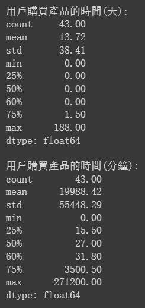

# Ecommerce_Project（Python）

[Colab Notebook 完整文字內容及程式碼在這裡](https://github.com/ThomasTsao47/Ecommerce_Project/blob/main/Files/Ecommerce_Project.ipynb)

## 0.目錄
1. 專案概述
2. 資料來源
3. 工具使用
4. 套件載入
5. 資料探索及清洗
6. 資料分析<br>
  6-1 單變量分析<br>
  6-2 多變量分析<br>
    * 6-2-1 初步探索
      * 6-2-1-1 目前有多少用戶？其中有多少人至少購買過一次？每位顧客的平均購買次數？
      * 6-2-1-2 用戶購買產品的平均時間？
      * 6-2-1-3 此次購買與上次購買的平均間隔時間？
      * 6-2-1-4 用戶是否在購買前會將產品加入購物車 or 直接購買？
    * 6-2-2 用戶行為分析
      * 6-2-2-1 用戶活躍度
      * 6-2-2-2 用戶行為路徑
    * 6-2-3 產品表現分析
      * 6-2-3-1 價格與購買數量
      * 6-2-3-2 辨識熱門商品
    * 6-2-4 客戶分群分析
      * 6-2-4-1 RFM 分析模型
7. 特徵工程<br>
  7-1 建立特徵（基於用戶）<br>
  7-2 建立特徵（基於產品 類別/子類別）<br>
  7-3 準備資料供預測模型使用<br>
    * 7-3-1 資料選擇及整併
    * 7-3-2 缺失值插補
    * 7-3-3 類別轉數值
    * 7-3-4 特徵縮放
8. 模型建立
9. 結論與建議
10. 參考資料

## 1.專案概述
背景源於一家販售各種產品（如家電，3C，食物和飲料，門鎖，嬰兒用品等）的早期電商公司，希望提升其產品銷售轉化率。為了增加客戶購買意願，該公司打算提供折價券以刺激消費，但由於**折扣活動**的預算有限，因此希望透過分析用戶行為，以決定提供折價券的有利時機，從而優化業務流程。為此，我們分別從**用戶角度**及**產品角度**進行分析，並使用實務上常見的顧客價值分析方法 - **RFM 模型**，用於客戶分群，以了解不同客戶群體的消費行為，進而提供針對性的營銷策略。此外，我們從用戶消費流程中找出了適合提供折價券的情境，並建立**預測模型**，該模型用以預測符合上述情境的使用者購買產品的機率，透過該模型，我們能找出潛在放棄消費的用戶，並提供折價券以鼓勵購買，而不是將折價券提供給非常有可能會購買的用戶。最終，我們在不同層面提供了相應的決策建議，並期望透過預測模型提升產品銷售轉化率，以有效利用折扣預算。

## 2.資料來源
* 資料來源：[Open Data on AWS](https://aws.amazon.com/tw/opendata/?wwps-cards.sort-by=item.additionalFields.sortDate&wwps-cards.sort-order=desc)
* 資料期間：2019年1月1日至2019年12月22日
* 資料集：[Datasets](https://github.com/ThomasTsao47/Ecommerce_Project/blob/main/Data/customer_data.xlsx)
* 欄位字典：

| 欄位名稱 | 描述 |
|----------|------|
| **User_id** | 用戶的 ID |
| **Session_id** | 每個 Session 的 ID |
| **DateTime** | 動作發生的時間戳，格式為 YYYY-MM-DD HH:MM:SS |
| **Category** | 商品的主類別 |
| **SubCategory** | 商品的子類別 |
| **Action** | 用戶執行的動作 |
| **Quantity** | 購買的商品數量 |
| **Rate** | 單個商品的價格 |
| **Total Price** | 總價（Quantity 乘以 Rate） |

## 3.工具使用
* 程式語言：Python 3.10.12（pandas、numpy、matplotlib、seaborn、sklearn、 spacy、datetime）
* AI工具：[ChatGPT-4o](https://openai.com/index/hello-gpt-4o/)（提供分析框架靈感及數據洞察，代碼優化），[Claude 3.5](https://www.anthropic.com/news/claude-3-5-sonnet)（提供用戶行為路徑流程圖設計靈感）
* 繪圖軟體：[draw.io](https://app.diagrams.net/)（製作預測模型情境圖）

## 4.套件載入
```
# 常用套件
import pandas as pd
import numpy as np
import matplotlib.pyplot as plt
import seaborn as sns
sns.set_theme(style='whitegrid')
pd.set_option('display.max_rows',400)
pd.set_option('display.max_columns',200)
pd.set_option('display.max_colwidth',None)

from datetime import timedelta
import gc

# spaCy 的英文模型
import spacy
nlp = spacy.load('en_core_web_sm')

# Feature Encoding
from sklearn.preprocessing import OneHotEncoder

# Feature Scaling
from sklearn.preprocessing import MinMaxScaler

# ML Model
from sklearn.model_selection import train_test_split, cross_val_predict
from sklearn.linear_model import LogisticRegression
from sklearn.metrics import accuracy_score, confusion_matrix, precision_score, recall_score, f1_score, roc_auc_score
```

```
import warnings
warnings.filterwarnings('ignore')
```

## 5.資料探索及清洗
* 檢查是否有重複值
* 檢查資料缺失情形
* 檢查欄位是否有拼寫錯誤（typos）或不一致（inconsistency），須將文字進行調整，使規則一致。例如：
  * `Category` 出現 'Music\n'，須將單詞兩側的分隔符號去除
  * `Category` 出現 'Air conditioner' 及 'Air Conditioner'兩種值，須將兩者統一文字規則，例如統一為 'Air Conditioner'，以確保後續分析數據之正確性
* 確認欄位計算之正確性。例如：
  * `Quantity` * `Rate` 是否皆等於 `Total Price`
* 調整資料型態 - 將 DateTime 欄位轉換為 datetime 格式

**清洗後資料**：<br>
<br><br>
**筆數及型態**：<br>
<br>

[完整文字內容及程式碼在這裡](https://github.com/ThomasTsao47/Ecommerce_Project/blob/main/Files/Ecommerce_Project.ipynb)

## 6.資料分析
此章節將透過單變量分析來掌握特徵的資料分布，並透過多變量分析了解特徵間的關係，以便後續能在**特徵工程**和**模型建立**的章節中有所幫助。

### 6-1 單變量分析
**`Category` 資料分布**<br><br>


<br>**`SubCategory` 資料分布**<br><br>


<br>**`Action` 資料分布**<br><br>


<br>以下的 `Quantity, Rate, Total Price` 皆為數值型特徵，我們除了掌握特徵的資料分布外，也將採用**非參數方法**，使用**分位數**進行**離群值檢測**，透過將數據點進行大小順序，比較每個數據點與其他數據點的差距來辨識離群值，從中若有發現與其他數據點顯著不同的點將被視為離群值。

**`Quantity` 資料分布**<br><br>


<br>**`Rate` 資料分布**<br><br>


<br>**`Total Price` 資料分布**<br><br>


[完整文字內容及程式碼在這裡](https://github.com/ThomasTsao47/Ecommerce_Project/blob/main/Files/Ecommerce_Project.ipynb)

### 6-2 多變量分析
多變量分析有助於我們了解兩個或多個特徵的關係以及其與潛在目標變數的關係。

#### 6-2-1 初步探索
我們首先想了解一些直覺上會想到的問題：

##### 6-2-1-1 目前有多少用戶？其中有多少人至少購買過一次？每位顧客的平均購買次數？


##### 6-2-1-2 用戶購買產品的平均時間？


##### 6-2-1-3 此次購買與上次購買的平均間隔時間？


##### 6-2-1-4 用戶是否在購買前會將產品加入購物車 or 直接購買？


<br>**總結與建議**
  * 大多數用戶在電商平台上進行購物的過程是快速且高效的，但也存在少數用戶需要更長的時間來完成購買。這可能是因為他們在決策過程中需要更多的時間，或者他們在多次訪問後才完成購買
  * 用戶在電商平台上的購買週期存在較大的差異，有些用戶在長時間內沒有再次購買產品，建議對於購買間隔較長的用戶，制定針對性的營銷策略，通過促銷、提醒等手段促進他們的再次購買
  * **針對加入購物車的用戶**：
    - **提醒和促銷**：可以設置購物車提醒，通過電子郵件或推播通知提醒用戶完成購買，或是提供針對性優惠或折扣，促使用戶在購物車中的商品更快結帳，特別是在他們的購物車中有商品數天未結帳時
  * **針對直接購買的用戶**：
    - **快速結帳體驗**：優化直接購買流程，確保用戶可以快速便捷地完成購買，提升購物體驗

[完整文字內容及程式碼在這裡](https://github.com/ThomasTsao47/Ecommerce_Project/blob/main/Files/Ecommerce_Project.ipynb)

<br>有了上述問題的初步了解後，從下個小節開始會針對特定面向進行分析

#### 6-2-2 用戶行為分析
- **用戶活躍度**：分析用戶活躍時間，透過 `DateTime` 欄位來觀察用戶在哪些時間段最活躍
- **用戶行為路徑**：追踪用戶在網站上的行為路徑，透過 `Action` 欄位觀察用戶從 'first_app_open' 到最終 'purchase'，分析不同路徑的轉化情形

##### 6-2-2-1 用戶活躍度


**觀察**
- **用戶活動高峰期**：圖中顯示出多個用戶活躍度高峰期，特別是在2019年的幾個特定月份，如9月至11月。這些高峰期可能與特定的節日有關，例如：11月的高峰期可能與“雙十一”購物節有關，這是一個全球性的網購促銷活動。此外，亦發現用戶行為活躍的情形多落在每月月中以前，猜測可能是公司的促銷活動多落在此期間
- **用戶活動低谷期**：在2019年的某些月份，如4月至8月的用戶活動較低。可能表明這些月份缺乏大型促銷活動或節日，因此用戶訪問量相對較少

下圖查看用戶活躍情形與產品平均價格的變化趨勢，以驗證上述**高峰期**的猜測是否合理。


**觀察**
* 確實在用戶較為活躍的時間點所消費的產品平均價格較低，可能說明公司在此期間的促銷活動成功吸引到重視價格的用戶進行消費

下面我們也從不同時間維度，包含月（Month），星期（Day of Week）及小時（Hour），查看用戶活躍情形。


**觀察**
- **10月及11月活躍度最高**：從圖中可以明顯看出，10月至11月的用戶活躍度高於其他月份。這可能是因為11月有雙十一購物節，而在那之前可能有一系列的預熱活動（Pre-Sale）
- **其餘月份活躍度較均勻**：除10月及11月外，其他月份的用戶活躍度相對均勻，沒有特別突出的月份

**補充 - 行銷活動的前期預熱**
* 預熱（Pre-Sale）的操作，在電商的行銷活動規劃中十分常見，特別是在節慶或是雙十一、三八女王節…等大檔期，在活動的前幾周，甚至在一個月前，部分品牌就已經摩拳擦掌，設計了各種形式的預熱，以搶消費者的目光、錢包。（引自 [Running Mate Marketing, 2022](https://runningmatemarketing.com/blog/2022/09/14/%E8%A1%8C%E9%8A%B7%E6%B4%BB%E5%8B%95-5-%E7%A8%AE%E9%A0%90%E7%86%B1%E6%96%B9%E5%BC%8F/#:~:text=%E5%9C%A8%E8%A1%8C%E9%8A%B7%E6%B4%BB%E5%8B%95%E7%9A%84%E8%A6%8F%E5%8A%83%E4%B8%8A%EF%BC%8C%E8%8B%A5%E5%81%9A%E5%A5%BD%E9%A0%90%E7%86%B1%EF%BC%8C%E5%B0%B1%E8%83%BD%E6%8F%90%E6%97%A9%E6%90%B6%E4%BD%94%E6%B6%88%E8%B2%BB%E8%80%85%E7%9A%84%E6%B3%A8%E6%84%8F%E5%8A%9B%EF%BC%8C%E6%8F%90%E5%8D%87%E5%A4%A7%E5%AE%B6%E5%B0%8D%E6%B4%BB%E5%8B%95%E7%9A%84%E9%97%9C%E6%B3%A8%E5%BA%A6%EF%BC%8C%E9%80%8F%E9%81%8E%E5%90%84%E9%A1%9E%E5%9E%8B%E7%9A%84%E9%A0%90%E7%86%B1%E6%B4%BB%E5%8B%95%EF%BC%8C%E8%83%BD%E9%80%90%E6%AD%A5%E5%A0%86%E7%96%8A%E6%B6%88%E8%B2%BB%E8%80%85%E5%B0%8D%E6%B4%BB%E5%8B%95%E7%9A%84%E6%9C%9F%E5%BE%85%EF%BC%8C%E4%B8%A6%E5%9C%A8%E6%B4%BB%E5%8B%95%E7%95%B6%E5%A4%A9%E5%81%9A%E6%B6%88%E8%B2%BB%E3%80%82,%E6%9C%80%E9%87%8D%E8%A6%81%E7%9A%84%E6%98%AF%EF%BC%8C%E4%B9%9F%E8%AE%93%E4%BB%96%E5%80%91%E7%9F%A5%E9%81%93%E8%87%AA%E5%B7%B1%E7%9A%84%E9%8C%A2%E5%8C%85%E5%BF%85%E9%A0%88%E7%82%BA%E4%BA%86%E9%80%99%E5%80%8B%E6%B4%BB%E5%8B%95%E5%81%9A%E9%A0%90%E7%95%99%EF%BC%8C%E5%90%A6%E5%89%87%E6%B4%BB%E5%8B%95%E9%82%84%E6%B2%92%E5%88%B0%EF%BC%8C%E5%A4%A7%E5%AE%B6%E7%9A%84%E9%8C%A2%E5%8C%85%E9%83%BD%E5%B7%B2%E7%B6%93%E6%89%81%E4%BA%86%EF%BC%8C%E8%B2%B7%E5%85%B6%E5%AE%83%E5%93%81%E7%89%8C%E7%9A%84%E5%95%86%E5%93%81%EF%BC%8C%E6%88%96%E6%98%AF%E5%90%84%E7%A8%AE%E7%94%9F%E6%B4%BB%E9%96%8B%E9%8A%B7%EF%BC%8C%E5%B0%B1%E8%AE%93%E5%A4%A7%E5%AE%B6%E6%8E%8F%E4%B8%8D%E5%87%BA%E9%8C%A2%E4%BA%86%E3%80%82)）

<br>

**觀察**
- **週一活躍度最高**：用戶在週一的活躍度最高，這可能是因為週一通常是新的工作週的開始，用戶可能會利用週一來進行網購計劃或查找新的產品，以釋放 Blue Monday 的沮喪😆
- **週三和週四活躍度較高**：除了週一，週三和週四的用戶活躍度也比較高，這可能是因為週中有某些促銷活動
- **週六活躍度最低**：週六的用戶活躍度最低，這可能是因為用戶在週末通常會有其他的休閒活動，而非網購

<br>

**觀察**
- **下午2點至3點和傍晚5點及7點活躍度高**：用戶在下午2點到3點（午休時間結束後）以及晚上5點及7點（下班時間）的活躍度最高
- **清晨和深夜活躍度低**：早上8點之前和晚上11點之後的用戶活躍度較低，這符合人們的日常作息規律，通常在這些時間段較少進行網購

<br>**總結與建議**
- 用戶活躍度和平均價格之間存在一定的相關性
- 潛在的促銷活動顯著影響用戶的訪問行為
- 通過進一步分析這些高峰期和低谷期的詳細數據，可以更好地理解用戶行為和營銷活動的效果，從而優化未來的市場策略
- 潛在的促銷活動或節日顯著影響用戶的月度活躍度，特別是10月及11月
- 週一的活躍度最高，可能是因為新的工作週開始，用戶開始進行網購計劃或查找新的產品，以釋放 Blue Monday 的沮喪😆
- 下午和晚間是用戶活躍的高峰時段，這些時間段可能是推廣活動的最佳時機
以上發現可以幫助公司制定更有效的營銷策略，並在適當的時間點進行推廣活動和促銷活動，以最大化用戶參與度及轉化率。例如，在週一或下午和晚間進行推廣活動可能會獲得更好的效果。


## 5.資料收集
### 5-1 載入 YOUTUBE API KEY
### 5-2 取得 channelId
### 5-3 Channel
### 5-4 Playlist
### 5-5 Video
### 5-6 VideoCategory
### 5-7 Comment


## 8.資料分析
以下分析的資料包含 Youtube 所有的影片類型：一般影片，shorts，直播，Podcast

### 8-1 頻道總訂閱數，總影片數，總觀看數
頻道成立時間先後排序為：Men's Game 玩物誌（2007年），Joeman（2010年），Dcard Video（2016年），木曜4超玩（2017年），志祺七七X圖文不符（2018年）。

首先初探幾個宏觀指標，包含總訂閱數，總影片數，總觀看數，以了解各頻道目前的情況，並展開後續的分析。<br>

<br>
<sub>
分析資料期間：由頻道成立起至2024年4月27日<br>
</sub>

概覽頻道的幾個宏觀指標（以下指標皆由大至小排序，數字為約略數）：
* 總訂閱數前三：Joeman（258萬），木曜4超玩（234萬），志祺七七X圖文不符（142萬）
* 總影片數前三：志祺七七X圖文不符（3,891支），Joeman（2,193支），Men's Game 玩物誌（1,353支）
* 總觀看數前三：Joeman（10億6千萬次），志祺七七X圖文不符（8億9千萬次），木曜4超玩（8億4千萬次）

上圖發現 "志祺七七X圖文不符" 頻道最晚成立，然而可能因發布影片數最多，使得總觀看數位居第2，總訂閱數位居第3。

### 8-2 每月平均觀看數
此部分觀察各頻道影片於每月的平均觀看數，以了解影片觀看情形隨時間的變化。這裡不選擇觀察較短的時間周期（如每日，每周），因為資料點會太密集而造成趨勢變化觀察不易。

補充：因為無法取得影片隨時間演進的觀看數變化，因此我們假設每支影片的觀看數的主要貢獻是集中在影片上傳後的一個月內，以方便了解觀看數的趨勢變化。

<br>
<sub>
分析資料期間：由頻道成立起至2024年4月27日<br>
</sub>

上圖可發現2016年以前僅有兩個頻道存在，且觀看數變化不大，因此下面針對2016年以後的資料進行分析

<br>
<sub>
分析資料期間：2016年1月1日至2024年4月27日<br>
</sub>

觀察每月平均觀看：
* "木曜4超玩"：2023年以前落在100萬以上
* "Joeman" 及 "Dcard Video"：2020至2023年間，約落在50萬至100萬
* "志祺七七X圖文不符" 及 "Men's Game 玩物誌"：約落在50萬以下

2023年以後，多數頻道的觀看數皆呈現下降趨勢，可能原因為近年自媒體盛行使得Youtube平台的越趨競爭，而導致流量紅利逐漸變小。

### 8-3 觀眾互動程度
觀察"影片得到觀眾按讚的比率"及"影片得到觀眾留言的比率"，以了解不同頻道下，觀眾與頻道主的互動程度。

建立指標：
* like_per_view(%)：Number of Likes / Number of Views * 100
* comment_per_view(%)：Number of Comments / Number of Views * 100

<br>
<sub>
分析資料期間：2016年1月1日至2024年4月27日<br>
</sub>

觀察每月平均按讚比例及留言比例：
* "志祺七七X圖文不符" 相較其他4個頻道的按讚比例明顯較高，且隨時間呈上升趨勢；而留言比例亦相較其他4個頻道來得高，但隨時間呈下降趨勢。（可能原因請見下一節：每月發布影片數及影片平均長度）
* "Men's Game 玩物誌" 的留言比例在2018年後持續位於前段第2，查看發現頻道主較常回應觀眾留言。此外，在2017年5月份有較高比例的留言數，查看發現當月份有支抽獎活動的影片帶動起後續幾日其他影片留言數的居高

### 8-4 每月發布影片數及影片平均長度
了解不同頻道的發片頻率及長短影片策略對觀看情形的可能影響也非常重要，有助於調整優化發布策略以吸引留存目標觀眾。

<br>
<sub>
分析資料期間：2016年1月1日至2024年4月27日<br>
</sub>

觀察每月發布影片數：
* "志祺七七X圖文不符" 一開始是每月發布約30支影片，自2021年5月開始錄製短影音shorts而提升到每月約60支影片，自2022年1月以後則提升到90支，可能為造成上述按讚比例及留言比例有明顯變化的原因
* 除 "志祺七七X圖文不符" 以外的4個頻道，每月發布影片數平均都落在30支以下

觀察每月發布影片平均長度：
* "木曜4超玩" 在2022年11月以前皆發布長影片居多，2022年11月以後開始發布較多shorts短影片，可能是造成上述每月平均觀看數在2023年以後逐漸下降的原因，也說明它原本的主要觀眾應是較喜歡長影片內容的觀眾群，因此建議該頻道保持主打一貫的長影片風格，應能較好的發揮優勢，改善其下降的觀看數
* "志祺七七X圖文不符" 及 "Dcard Video" 的影片多數落在20分鐘以內，可能說明兩者皆嚴格執行特定的影片長度策略

下面進一步查看所有頻道的影片，比較影片時間小於2分鐘及超過2分鐘，分別在按讚比例及留言比例上的差別，發現短影音確實更容易取得讚數，但較不會獲得觀眾留言。<br>
<br><br><br>

### 8-5 影片發布時間
透過影片發布時間可了解各頻道是否考慮了觀眾看YT影片的時間習慣，或是僅僅只是按照上班時的工作習慣進行影片發布。

<br>
<sub>
分析資料期間：2016年1月1日至2024年4月27日<br>
</sub>

觀察影片發布時間：
* "木曜4超玩" 在2022年11月以前主要集中在中午12點至15點，2022年11月以後則較不固定，大概是因為該時間點以後多了短影片，拍攝所需時間較短，能較隨意發布
* "Dcard Video" 及 "Joeman" 主要集中在早上10點至12點發布影片，判斷兩者應該都是提前錄製好影片，因此皆設定好固定上片的時間
* "Men's Game 玩物誌" 在2022年8月以後有一部分集中在凌晨12點至1點，推測有可能想吸引海外的觀眾
* "志祺七七X圖文不符" 集中在早上8,11,13點，查看發現該頻道每日約上傳2支短影片及1支一般影片

整體來說，發布時間多數落在白天10點至15點，而若對照每月平均觀看數來看，或許嚴格遵守同一時間的發布是個可行的策略。

### 8-6 影片最常設定的標籤（Tags）
標籤的設定有其重要性，通常是影片的關鍵字，能幫助觀眾尋找特定的影片內容，以提升點閱率。此外，下面透過分析各頻道不同時期所設定的前10名標籤，可了解影片主題類型的變化趨勢。

<br>
<sub>
分析資料期間：由頻道成立起至2024年4月27日<br>
</sub>

觀察影片最常設定的標籤：
* "木曜4超玩" 常設標籤可以看出該頻道主要的常態性參與人及常見的影片系列，像是"一日系列" 及 "下班去吃飯" 等
* "Dcard Video" 主要透過街訪，校訪的方式討論有關男女生，大學生的話題，而常見的影片系列如"Dcard尋奇"，"Dcard調查局"等
* "Men's Game 玩物誌" 該頻道從早期介紹公路車，科技3C，遊戲，到後來拍攝旅遊，開箱，養老等話題
* "Joeman 常設標籤包含遊戲，實況，汽車等，但該頻道實際上在過去也有許多3C的開箱影片，以及系列影片如"Joe是要對決"，這部分皆沒出現在標籤中，判斷應是頻道主沒有設定該類標籤，因此建議可增加相關標籤，方便觀眾更好找到相關影片
* "志祺七七X圖文不符" 主要探討時事新聞，國際議題，另外可看出近年所使用的標籤文字更加具體

### 8-7 觀看數最多的影片標題
從觀看數最多的影片中可了解標題如何設定較能夠吸引觀眾眼球，進而提升點擊率。因此，下面我們找出各頻道最多觀看數的前10名影片。

<br>
<sub>
分析資料期間：由頻道成立起至2024年4月27日<br>
</sub>

分析觀看數最多的影片標題：
* "Dcard Video" 標題主要與存款，8+9女友好正，暈船，消費習慣等文字有關，其中有將近半數的影片都有使用對比不同群體的文字（如敗家&節儉，有錢人&平民），而有明星客串在內的影片佔了2部
* "Joeman" 前5名的影片都有網紅或知名人物的客串（如老高，郭台銘），而飛機搭乘體驗佔了3部，對決高檔與平價系列的影片則佔了2部
* "Men's Game 玩物誌" 有女網紅客串的影片佔據第1，另外有提到IPhone的文字也較為熱門。此外，也有用到具對比意思的文字（組合屋vs貨櫃屋，山寨vs正品）
* "志祺七七X圖文不符" 標題主要是跟兩岸議題，國際議題，新聞時事有關，其中shorts短影音竟佔了7部，說明該頻道的shorts影片可能相較一般影片來得更吸引觀眾
* "木曜4超玩" 前6名的影片主要是包含影片系列的文字，如"一日系列"，"全明星運動會"等。此外，該頻道有兩部破千萬觀看的影片皆有相關知名人物的客串

整體來說，除"志祺七七X圖文不符"以外的4個頻道，第一名的影片皆有網紅或知名人物客串在內。此外，對比類型的影片標題也是獲得高觀看數的可能原因。

### 8-8 影片標題及影片說明的字數 & 標籤使用數量
最後查看各頻道對於與影片內容有關的文字設定是否遵循特定規律。

<br>
<sub>
分析資料期間：由頻道成立起至2024年4月27日<br>
</sub>

觀察影片標題的字數：
* 無發現特定規律
觀察影片說明的字數：
* "志祺七七X圖文不符" 相較其他4個頻道所使用的影片說明字數來的多，查看發現該頻道在說明區裡放的內容涵蓋了製作團隊，影片分節內容，參考資料及相關連結等較詳盡的資料
觀察影片使用的標籤數量：
* "Joeman" 在2019年以後使用標籤的數量幾乎都是29個，對照上述"影片最常設定的標籤"章節，確實觀察到在該年以後的標籤使用幾乎沒變，說明該頻道主應是已不太在意標籤的設定及使用數量
* "Dcard Video" 是所有頻道中最不常使用標籤的

整體而言，並無觀察到各頻道對於上述三個部分有特定的設定規律。

## 9.結論
* 為了解臺灣知名 Youtube 頻道的經營策略及表現，因此透過 API 取得 5 個頻道的資料，並使用 Python 分析頻道訂閱數，影片數，觀看數，觀眾互動程度，影片發布策略，影片文字設定策略等，以了解各頻道間的差異，並提供相關決策建議，期望提升影片點擊率及吸引目標用戶
* 2023 年以後，多數頻道的月平均觀看數皆呈現下降趨勢，可能是近年自媒體盛行使得 Youtube 平台的越趨競爭，而導致流量紅利逐漸變小
* 分析所有頻道的影片，發現短影音更容易取得讚數，但較少獲得觀眾留言
* "志祺七七X圖文不符" 及 "Dcard Video" 的影片多數落在20分鐘以內，可能說明兩者皆嚴格執行特定的影片長度策略
* 除"志祺七七X圖文不符"以外的4個頻道，各自觀看數第一名的影片皆有網紅或知名人物客串在內。此外，對比類型的影片標題也是獲得高觀看數的可能原因

## 10.建議
* "木曜4超玩" 在2022年11月以前皆發布長影片居多，2022年11月以後開始發布較多shorts短影片，可能是造成上述每月平均觀看數在2023年以後逐漸下降的原因，也說明它原本的主要觀眾應是較喜歡長影片內容的觀眾群，因此建議該頻道保持主打一貫的長影片風格，應能較好的發揮優勢，改善其下降的觀看數
* "Joeman" 頻道內容中有許多3C的開箱影片，以及系列影片如"Joe是要對決"，這部分皆沒出現在標籤中，因此建議可增加上述類型標籤，方便觀眾更好找到相關影片

## 11.參考資料
* [新創如何與 YouTuber 合作，借助他們的影響力](https://appworks.tw/startup-youtuber-marketing/)
* [YouTube Data API (v3) - Quota Calculator](https://developers.google.com/youtube/v3/determine_quota_cost)
* [Youtube行銷怎麼做？最新Youtube行銷策略和短影音分析看這裡](https://twfirst.com.tw/digital-marketing/youtube-marketing/)
* [如何提升 YouTube 點閱率？YouTube 標籤是什麼？為什麼很重要？](https://tw.cyberlink.com/blog/youtube-video-editing/543/youtube-seo)
* [台灣YouTube頻道訂閱人數排行榜](https://zh.wikipedia.org/wiki/%E5%8F%B0%E7%81%A3YouTube%E9%A0%BB%E9%81%93%E8%A8%82%E9%96%B1%E4%BA%BA%E6%95%B8%E6%8E%92%E8%A1%8C%E6%A6%9C)
* [訂閱人數最多的YouTube頻道](https://zh.wikipedia.org/wiki/%E8%AE%A2%E9%98%85%E4%BA%BA%E6%95%B0%E6%9C%80%E5%A4%9A%E7%9A%84YouTube%E9%A2%91%E9%81%93)

